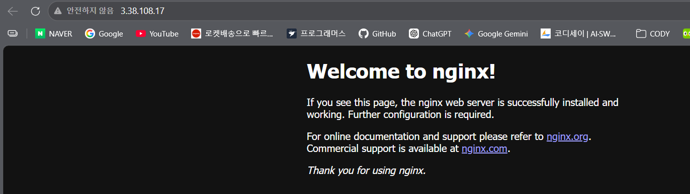
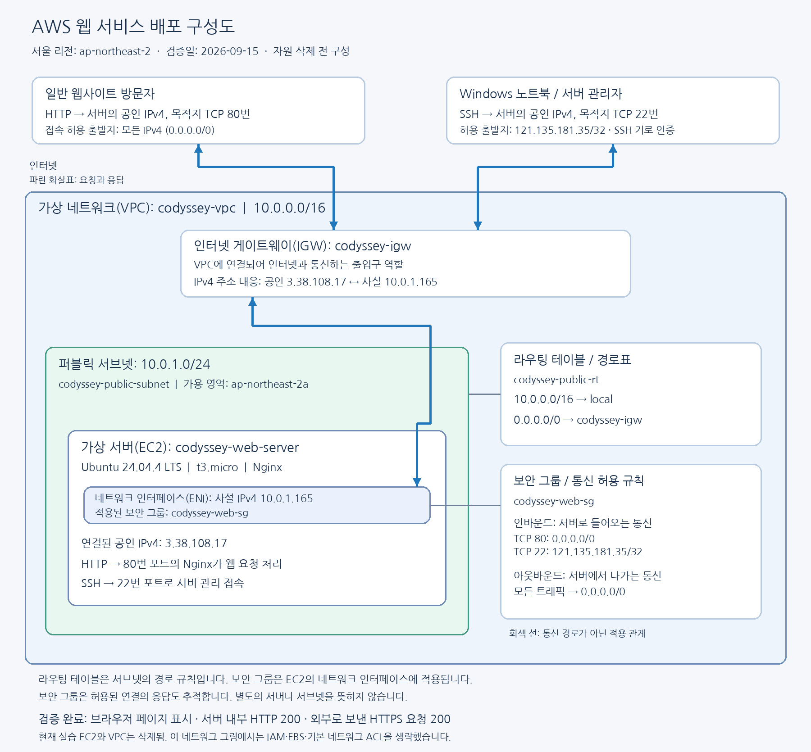
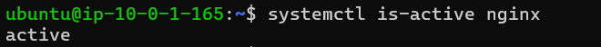
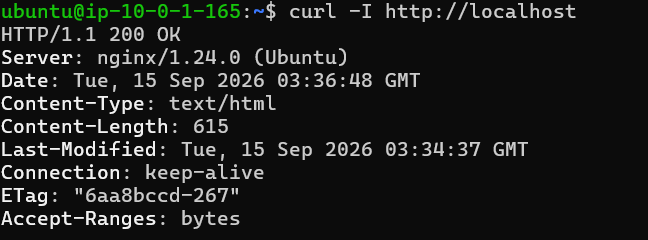
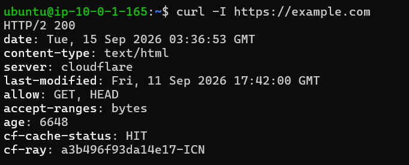
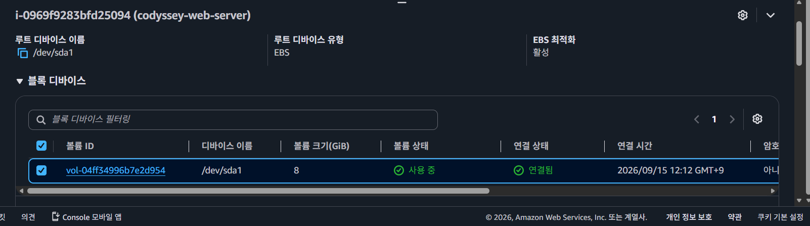
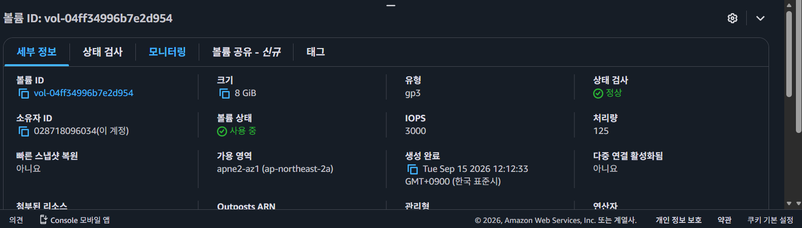
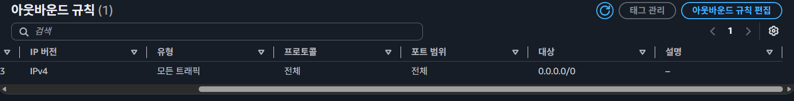

# 내가 만든 웹사이트를 인터넷에 올려 누구나 쓰게 하기  

## 1. 목표와 결과  

직접 구성한 VPC의 퍼블릭 서브넷에 Ubuntu EC2를 배치하고 Nginx를 설치했다. HTTP는 모든 IPv4에서 접근하도록, SSH는 실습자 공인 IP 하나에서만 접근하도록 설정했다. Windows PowerShell에서 SSH 접속 후 서버 내부 및 외부 통신을 확인했다.  

외부 접속 검증은 **A 방식: 브라우저 접속**을 선택했다.  

- 검증 URL: **http://3.38.108.17**  
- 검증 결과: **Welcome to nginx!** 페이지 표시  
- 검증 시점의 주소이며, 인스턴스 중지·시작 시 바뀔 수 있고 삭제 후에는 접속할 수 없다.  

  

## 2. 제출 파일  

| 파일 | 내용 |  
|---|---|
| README.md | 환경, 구축 절차, 검증 결과 및 증거 |  
| docs/architecture.png | 네트워크 구성 및 요청 흐름 |  
| docs/troubleshooting.md | SSH 개인 키 권한 오류 분석·해결 |  
| docs/cleanup-checklist.md | 실습 자원 목록, 삭제 순서, 확인란 |  
| docs/screenshots/ | 실습자가 제공한 원본 증거 화면 26개 |  

## 3. 구성도  

  

인터넷 게이트웨이는 VPC에 연결되고, 서브넷은 라우팅 테이블을 참조한다. 보안 그룹은 EC2의 네트워크 인터페이스에 적용된다. 그림의 라우팅 표는 통신 중간에 놓이는 서버가 아니라 경로 선택 규칙이다.  

## 4. 실습 환경과 자원  

| 항목 | 실제 구성 |  
|---|---|
| 작업 PC | Windows 노트북, PowerShell/OpenSSH |  
| AWS 계정 플랜 | Free plan 가입 완료(실습자 진술) |  
| 실습 사용자 | codyssey-student |  
| 리전 / 가용 영역 | ap-northeast-2 / ap-northeast-2a |  
| VPC | codyssey-vpc / vpc-0e808b35dd5e2de5f / 10.0.0.0/16 |  
| 서브넷 | codyssey-public-subnet / subnet-0e66198c96f9834df / 10.0.1.0/24 |  
| 인터넷 게이트웨이 | codyssey-igw / igw-0713ed7b6c2dadf71 / Attached |  
| 라우팅 테이블 | codyssey-public-rt / rtb-055eafc503f43cf59 |  
| 보안 그룹 | codyssey-web-sg / sg-09e767b31257706d3 |  
| EC2 | codyssey-web-server / i-0969f9283bfd25094 / t3.micro |  
| 서버 OS | Ubuntu 24.04.4 LTS / x86_64(SSH 출력 확인) |  
| 퍼블릭 IPv4 | 3.38.108.17 |  
| 프라이빗 IPv4 | 10.0.1.165 |  
| 키페어 이름 | codyssey-key(개인 키 파일은 제출물에서 제외) |  
| Nginx | 1.24.0 Ubuntu(HTTP 응답 헤더 확인) |  
| 스토리지 | 8GiB gp3 / vol-04ff34996b7e2d954 / 연결됨·사용 중 확인 |  

### 라우팅과 보안 규칙  

| 구분 | 목적지 또는 소스 | 대상 또는 포트 |  
|---|---|---|
| VPC 내부 경로 | 10.0.0.0/16 | local |  
| 인터넷 경로 | 0.0.0.0/0 | igw-0713ed7b6c2dadf71 |  
| 인바운드 HTTP | 0.0.0.0/0 | TCP 80 |  
| 인바운드 SSH | 121.135.181.35/32(검증 당시) | TCP 22 |  
| 아웃바운드 | 0.0.0.0/0 / 모든 트래픽을 유지하도록 안내 | 전체 트래픽 허용 화면 및 외부 HTTPS 응답 확인 |  

퍼블릭 서브넷에는 인터넷 게이트웨이로 향하는 기본 경로가 필요하며, 이번 EC2의 IPv4 인터넷 통신에는 퍼블릭 IPv4도 필요하다. 보안 그룹의 HTTP 허용만으로 라우팅과 IP 설정을 대신할 수 없다.  

### IAM 권한  

화면에서 연결을 확인한 정책은 `CodysseyCloudLabSeoul`과 `IAMUserChangePassword`다. 루트는 초기 사용자·권한 준비에 사용하고, 이후 자원 생성은 codyssey-student로 진행했다.  

안내한 인라인 정책은 `aws:RequestedRegion = ap-northeast-2` 조건 아래 EC2 조회와 이번 VPC·서브넷·게이트웨이·라우팅·보안 그룹·키페어·인스턴스 생성/삭제 및 태그 작업을 허용한다. S3·RDS 관리나 AdministratorAccess는 부여하지 않았다. `IAMUserChangePassword`는 본인 비밀번호 변경에 사용한다.  

정책은 서비스·작업·리전 범위를 제한하지만 `Resource: "*"` 및 `ec2:Describe*`를 사용하므로 개별 실습 자원만으로 제한한 엄격한 최소 권한 정책은 아니다. 허용된 서울 리전의 작업은 다른 자원에도 적용될 수 있다. 제공된 정책 편집기 스크린샷 2장(1~60행)의 JSON 전체를 대조하여 안내한 정책과 일치함을 확인했다. 보안 그룹은 네트워크 통신을, IAM은 AWS API/콘솔 작업 권한을 제어한다.  

## 5. 구축 순서  

1. AWS 계정 가입 및 루트 MFA 설정 후 실습용 IAM 사용자와 정책을 준비했다.  
2. 서울 리전에서 VPC(10.0.0.0/16)와 서브넷(10.0.1.0/24)을 생성했다.  
3. 인터넷 게이트웨이를 VPC에 연결했다.  
4. 라우팅 테이블에 `0.0.0.0/0 → 인터넷 게이트웨이`를 추가하고 서브넷을 명시적으로 연결했다.  
5. HTTP 80 전체 허용, SSH 22 실습자 IP만 허용하는 보안 그룹을 생성했다.  
6. Ubuntu EC2 한 대를 생성하고 해당 서브넷·보안 그룹·키페어를 지정했다. 퍼블릭 IPv4 자동 할당을 활성화했다.  
7. Windows에서 SSH로 접속하고 Nginx를 설치·실행했다.  
8. 실행 상태, 내부 HTTP, 외부 HTTPS, 브라우저 HTTP 접속을 검증했다.  

### Windows에서 SSH 접속  

```powershell
cd "$env:USERPROFILE\Downloads"  
ssh -i ".\codyssey-key.pem" ubuntu@3.38.108.17  
```

개인 키 권한 오류가 발생하여 [트러블슈팅 보고서](docs/troubleshooting.md)의 절차로 해결했다. 접속 후 `whoami`의 결과는 `ubuntu`였다. SSH 사용자 ubuntu와 AWS IAM 사용자 codyssey-student는 별개의 사용자다.  

### Ubuntu에서 Nginx 설치 및 검사  

```bash
sudo apt update  
sudo apt install -y nginx  
sudo systemctl enable --now nginx  
systemctl is-active nginx  
curl -I http://localhost  
curl -I https://example.com  
```

`sudo`는 패키지 설치와 서비스 설정 등 관리자 권한이 필요한 명령에 사용했다. `curl -I`는 본문 대신 응답 헤더를 확인하는 HEAD 요청이다. 외부 접속 제출 방식은 GET /health가 아닌 브라우저 A 방식이다.  

## 6. 검증 결과  

| 검증 | 실제 관찰 결과 | 판정 |  
|---|---|---|
| SSH 사용자 | whoami → ubuntu | 통과 |  
| Nginx 서비스 | active | 통과 |  
| 서버 내부 HTTP | HTTP/1.1 200 OK | 통과 |  
| 서버에서 외부 HTTPS | HTTP/2 200 | 통과 |  
| 외부 브라우저 HTTP | Welcome to nginx! | 통과 |  
| 생성 직후 EC2 상태 검사 | 제공 화면은 초기화 / 2/3 통과 시점 | 3/3 결과 미수집 |  
| 필수 5종 자원 정리 | EC2 종료, EBS 없음, EIP 미할당, IGW·VPC 삭제 | 확인 완료 |  

  

  

  

### 구성 증거  

- [VPC](docs/screenshots/01-vpc.png), [서브넷](docs/screenshots/02-subnet.png), [게이트웨이 연결](docs/screenshots/03-internet-gateway.png)  
- [라우팅](docs/screenshots/04-routes.png), [서브넷 연결](docs/screenshots/05-subnet-association.png)  
- [인바운드 보안 규칙](docs/screenshots/06-security-group.png), [IAM 정책 목록](docs/screenshots/07-iam-policies.png)  
- [EC2 정보](docs/screenshots/08-instance.png), [SSH 연결 설정](docs/screenshots/09-ssh-settings.png)  


### 추가 확인: 스토리지와 아웃바운드  

루트 EBS는 `/dev/sda1`, `vol-04ff34996b7e2d954`, 8GiB gp3이며 인스턴스에 연결되어 사용 중이다. 볼륨 상세 화면의 상태 검사는 정상이며, 이것은 EC2 전체 상태 검사 3/3 통과 여부와 별개다. IOPS는 3000이다. 아웃바운드는 IPv4 모든 트래픽을 `0.0.0.0/0`으로 허용한다. 이후 `종료 시 삭제=true` 필터에 해당 볼륨이 조회되는 화면으로 자동 삭제 설정을 확인했으며, 종료 후 전체 볼륨 목록이 비어 있는 것도 확인했다.  

  

  

  

## 7. 정리 완료 증거  

실습 EC2와 네트워크는 삭제되어 기존 URL은 더 이상 이 실습 웹 서버의 접속 주소로 사용할 수 없다. 같은 IP가 이후 다른 대상에 재할당될 수 있으므로 결과 재검증을 위해 접속하지 않는다.  

| 자원 | 확인 결과 | 증거 |  
|---|---|---|
| EC2 | 대상 인스턴스 종료됨 | [종료 화면](docs/screenshots/20-ec2-terminated.png) |  
| EBS | 필터 없는 목록에 볼륨 없음 | [볼륨 목록](docs/screenshots/21-ebs-empty.png) |  
| EIP | 필터 없는 목록에 할당 없음 | [EIP 목록](docs/screenshots/19-eip-empty.png) |  
| IGW | 실습 ID 삭제 성공 | [삭제 알림](docs/screenshots/23-igw-deleted.png) |  
| VPC | 실습 ID와 이름 삭제 성공 | [삭제 알림](docs/screenshots/24-vpc-deleted.png) |  

[SSH 접속·서비스 통합 증거](docs/screenshots/18-ssh-verification.png), [종료 시 삭제 설정](docs/screenshots/17-delete-on-termination.png)도 포함했다.  

## 8. 평가 질문에 대한 설명  

### 항목 2: 구성과 선택 설명  

**네트워크 흐름:** 외부 브라우저가 EC2 퍼블릭 IP의 TCP 80으로 요청하면 VPC에 연결된 IGW를 통해 해당 서브넷의 EC2에 도달한다. 보안 그룹이 HTTP를 허용하고 Nginx가 응답한다. 서브넷의 라우팅 테이블에는 응답 등 외부 목적지로 나갈 때 사용할 IGW 기본 경로가 있다. 라우팅 테이블은 트래픽을 처리하는 별도 서버가 아니라 경로 규칙이다.  

**포트 최소화:** 웹 공개를 위해 80만 전체에 열고, 관리용 22는 실습 당시 공인 IP 하나(/32)에 한정했다. HTTPS는 구현하지 않았으므로 443 인바운드를 열지 않았다. DB를 배치하지 않았으므로 DB 포트도 열지 않았다. 서버에서 외부 HTTPS로 접속하는 아웃바운드와 외부에서 서버의 443으로 접속하는 인바운드는 다르다.  

**외부 검증 방식:** A(브라우저)를 선택했다. Nginx 기본 페이지와 퍼블릭 IPv4, HTTP 80 규칙, IGW와 기본 경로를 구성하고 주소창·페이지를 함께 캡처했다. B 방식의 /health는 구현하지 않아도 된다.  

**자원 추적:** codyssey- 접두어를 이름에 사용하고 VPC·서브넷·IGW·라우팅 테이블·EC2 등의 실제 ID를 표로 기록했다. 이름과 ID를 대조하여 삭제 대상을 구분했다. EBS는 별도 이름 대신 볼륨 ID와 EC2 연결 관계로 추적했다.  

### 항목 3: 원리와 보안 설명  

**기본 경로가 필요한 이유:** local 경로는 VPC 내부 주소만 처리한다. 외부 주소로 보내려면 해당 목적지를 포괄하는 경로가 필요하여 0.0.0.0/0을 IGW로 지정했다. 더 구체적인 local 경로가 내부 통신에 우선 적용된다.  

**Security Group과 IAM:** 보안 그룹은 서버 인터페이스의 네트워크 접근을 제어한다. IAM은 사용자가 AWS 자원을 생성·조회·삭제하는 작업 권한을 제어한다. 제한된 권한은 실수 또는 자격 증명 유출 시 영향을 줄인다. 이번 정책은 서비스·작업·리전을 제한했지만 개별 자원 ARN 또는 태그까지 제한한 정책은 아니라는 한계가 있다.  

**SSH·DB 포트를 전체에 열지 않는 이유:** 관리·데이터 접근 지점을 불특정 인터넷 사용자에게 노출하기 때문이다. SSH는 관리자 공인 IP/32 또는 VPN·관리 접속 체계로 제한하고, DB가 필요해지면 비공개 서브넷과 애플리케이션 보안 그룹을 소스로 하는 규칙을 검토한다. 이 대안은 설명이며 이번 실습에서 DB나 VPN을 구축하지 않았다.  

**가설 → 검증을 지킨 이유:** 오류 원인을 확인하지 않고 설정을 바꾸면 보안 범위가 넓어지고 원인을 추적하기 어렵다. 이번에는 OpenSSH가 로컬 키 권한을 명시적으로 거부한 출력을 근거로 ACL을 수정했고, 동일한 키·IP로 재접속하여 성공 여부를 검증했다.  

### 항목 4: 상황별 대응 설명  

**외부 접속 실패 시:** 라우팅(IGW 연결, 0.0.0.0/0, 서브넷 연결) → SG(프로토콜·포트·소스) → 퍼블릭 IP/DNS(현재 주소인지) → 서버 프로세스·로그 순서로 좁혀간다. 서버 내부에서는 `systemctl is-active nginx`, `curl -I http://localhost`, 필요 시 `sudo journalctl -u nginx --no-pager -n 50`와 `/var/log/nginx/error.log`를 확인한다. localhost 성공·외부 실패라면 외부 경로와 접근 규칙을 우선 의심한다. 로그 검사 명령은 대응 예시이며 이번 검증에서 실행했다는 의미는 아니다.  

**IAM 권한 부족 시:** AccessDenied의 작업명, 대상 자원, 리전과 요청 설정을 읽고 기존 정책의 Action·Resource·Condition을 비교한다. 필요하면 관리 권한을 가진 사용자에게 해당 작업과 대상에 필요한 범위만 추가하도록 요청하고 같은 작업을 재시도한다. 명시적 Deny나 조직 정책·권한 경계도 확인하며 AdministratorAccess를 무작정 부여하지 않는다. 이번 실제 문제는 IAM 오류가 아니라 Windows 개인 키 ACL 오류였다.  

**서버 2대로 확장해야 한다면:** 먼저 CPU·메모리·응답 시간·로그로 병목을 확인한다. 현재 단일 EC2는 처리량 한계와 단일 장애 지점이다. 두 EC2에 트래픽을 나누려면 ALB와 대상 그룹·상태 검사를 검토하고, ALB를 위한 서로 다른 가용 영역의 서브넷을 구성한다. EC2의 HTTP 접근은 ALB 보안 그룹에서만 받도록 바꾸는 구성을 고려한다. 파일·세션을 한 서버에만 저장했다면 공유 방식도 함께 설계해야 한다. ALB와 추가 인스턴스는 설명용 제안이며 실제 생성하지 않았다.  

**예상치 못한 비용이 보이면:** Billing에서 서비스·리전별 사용 내역을 좁힌 뒤 실행 중 EC2, 미사용 EBS·스냅샷, 퍼블릭 IPv4/EIP, NAT Gateway, 로드 밸런서, RDS 등의 존재 여부를 확인한다. codyssey 이름·태그와 ID 기록을 대조하고 필요한 증거를 저장한 후 해당 실습 자원만 정리한다. 자원 삭제가 과거 사용 내역을 지우지는 않으며 결제 반영 지연도 고려한다. Billing 화면 자체는 이번 제출 증거로 수집하지 않았다.  
